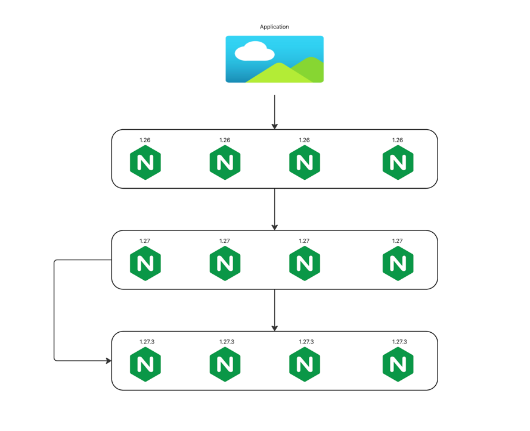

# KUBERNETES

Kubernetes is a powerful container orchestration platform, and it’s crucial for modern application deployment, management, and scaling in cloud-native environments. Here's why we need Kubernetes:

### 1. Container Management at Scale
Automation: Kubernetes automates the deployment, scaling, and management of containerized applications. Without Kubernetes, managing large numbers of containers across multiple machines would be complex and error-prone.
Orchestration: It handles the scheduling and running of containers on clusters of machines, ensuring that they’re distributed, replicated, and running as expected.
### 2. Scalability
Horizontal Scaling: Kubernetes makes it easy to scale applications up and down based on demand. It automatically adjusts the number of running instances of a containerized application based on CPU or memory usage, or custom metrics.
Auto-scaling: Kubernetes supports both horizontal pod autoscaling (scaling the number of pods based on load) and vertical pod autoscaling (adjusting resources per pod).
### 3. Fault Tolerance & Self-Healing
High Availability: Kubernetes monitors the health of containers and nodes. If a container or node fails, Kubernetes can automatically reschedule workloads to healthy nodes, ensuring minimal downtime.

Self-Healing: Kubernetes can restart failed containers, replace containers, or reschedule them on different nodes without human intervention.
### 4. Declarative Configuration
Kubernetes uses declarative configuration to define the desired state of applications. You specify what you want (e.g., how many replicas of a pod), and Kubernetes ensures that the system matches this state. If something changes or goes wrong, Kubernetes works to bring the system back to the desired state automatically.
### 5. Environment Consistency
Kubernetes abstracts away underlying infrastructure details, meaning your application can run consistently across different environments—whether it's on-premises, in a public cloud, or a hybrid setup.
Developers and operators can define applications in YAML files, ensuring that the same configurations work across different environments without needing manual tweaks.
### 6. Infrastructure Abstraction
Kubernetes decouples application development from the underlying hardware or cloud infrastructure. This makes it easier to switch between cloud providers or data centers without a major impact on how applications are deployed and managed.
Multi-cloud & Hybrid-cloud Support: It allows you to run applications across different cloud environments and even on-premise systems without vendor lock-in.
### 7. Microservices & Distributed Systems
Kubernetes is designed to manage applications composed of multiple loosely coupled services (microservices). It facilitates communication between microservices, such as load balancing and service discovery, while also allowing them to scale independently.
Networking and Load Balancing: Kubernetes handles networking between services and load balancing traffic automatically. It ensures services can discover each other through a built-in DNS system.
### 8. Efficient Resource Utilization
Kubernetes optimizes resource usage by dynamically allocating CPU and memory resources. It allows you to run workloads on bare metal or virtualized infrastructure while ensuring that resources are distributed efficiently.
### 9. Version Control & Rollbacks
Kubernetes supports rolling updates and rollbacks. This allows for seamless deployment of new versions of applications without downtime. If a new version of the application fails, Kubernetes can automatically roll back to the previous stable version.
### 10. CI/CD Integration
Kubernetes integrates well with continuous integration and continuous delivery (CI/CD) pipelines. You can automate the deployment of new code, run tests, and deploy updates in a consistent and repeatable manner.
### 11. Security
Kubernetes provides mechanisms like Role-Based Access Control (RBAC) to secure access to resources and control what users can do within a cluster.
It also supports network policies for controlling communication between services and can run containerized applications with specific security profiles to limit risks.
### 12. Ecosystem and Extensibility
Kubernetes has a vibrant ecosystem and a wide array of open-source tools built around it, such as Helm for package management, Istio for service meshes, and Prometheus for monitoring.
Kubernetes supports custom resource definitions (CRDs), which allow you to extend its functionality to suit your specific use cases.
## In Summary:
Kubernetes is essential because it automates and optimizes the complex tasks involved in deploying and managing containerized applications at scale. It helps with scaling, failover, monitoring, resource management, and simplifying application deployment, making it a cornerstone of modern DevOps, CI/CD, and cloud-native architectures. Without Kubernetes or a similar orchestrator, managing large, complex containerized environments would be a logistical nightmare.


# KUBERNETES ARCHITECTURE


```commandline
07:16:00 manojkrishnappa@Manojs-MacBook-Pro uday → kubectl get pods -n kube-system -o wide
NAME                                                        READY   STATUS    RESTARTS   AGE   IP           NODE                                NOMINATED NODE   READINESS GATES
coredns-7c65d6cfc9-g6xl4                                    1/1     Running   0          38m   10.244.0.2   manoj-cka-cluster-1-control-plane   <none>           <none>
coredns-7c65d6cfc9-g7g8r                                    1/1     Running   0          38m   10.244.0.3   manoj-cka-cluster-1-control-plane   <none>           <none>
etcd-manoj-cka-cluster-1-control-plane                      1/1     Running   0          38m   172.18.0.5   manoj-cka-cluster-1-control-plane   <none>           <none>
kindnet-48dd6                                               1/1     Running   0          38m   172.18.0.4   manoj-cka-cluster-1-worker          <none>           <none>
kindnet-ppgk8                                               1/1     Running   0          38m   172.18.0.5   manoj-cka-cluster-1-control-plane   <none>           <none>
kindnet-sdxp9                                               1/1     Running   0          38m   172.18.0.3   manoj-cka-cluster-1-worker2         <none>           <none>
kindnet-zz6hk                                               1/1     Running   0          38m   172.18.0.2   manoj-cka-cluster-1-worker3         <none>           <none>
kube-apiserver-manoj-cka-cluster-1-control-plane            1/1     Running   0          38m   172.18.0.5   manoj-cka-cluster-1-control-plane   <none>           <none>
kube-controller-manager-manoj-cka-cluster-1-control-plane   1/1     Running   0          38m   172.18.0.5   manoj-cka-cluster-1-control-plane   <none>           <none>
kube-proxy-lkpss                                            1/1     Running   0          38m   172.18.0.5   manoj-cka-cluster-1-control-plane   <none>           <none>
kube-proxy-qcph4                                            1/1     Running   0          38m   172.18.0.2   manoj-cka-cluster-1-worker3         <none>           <none>
kube-proxy-qkmjw                                            1/1     Running   0          38m   172.18.0.3   manoj-cka-cluster-1-worker2         <none>           <none>
kube-proxy-w486t                                            1/1     Running   0          38m   172.18.0.4   manoj-cka-cluster-1-worker          <none>           <none>
kube-scheduler-manoj-cka-cluster-1-control-plane            1/1     Running   0          38m   172.18.0.5   manoj-cka-cluster-1-control-plane   <none>           <none>

```

## Kubernetes Architecture Overview
Kubernetes is a container orchestration platform designed to automate the deployment, scaling, and operation of application containers. It has a complex yet well-defined architecture that is composed of several key components that work together to provide a scalable, reliable, and flexible platform for managing containerized applications.
Let’s break down the Kubernetes architecture into its key components:
### 1. Cluster Components
A Kubernetes cluster consists of two main parts: the control plane (responsible for managing the cluster) and the worker nodes (where your applications run).
### Control Plane
The control plane is responsible for the overall management of the Kubernetes cluster, making global decisions about scheduling, managing the state of the cluster, and responding to events (e.g., starting or stopping containers).
Key Components of the Control Plane:
### API Server (kube-apiserver):
•	The API server is the central management entity of Kubernetes, and it serves as the gateway to communicate with the cluster. It exposes the Kubernetes API, which is the interface that administrators and clients use to interact with Kubernetes (e.g., using kubectl, other Kubernetes services, or applications).
•	It is responsible for validating and processing REST requests, making decisions (such as scheduling) and updating resources in the etcd database.
•	All Kubernetes components communicate with each other via the API server.

### etcd:
•	etcd is a distributed key-value store used to store all cluster data, including configuration data, the state of the cluster, and metadata about the applications running in the cluster.
•	It ensures that the cluster is highly available and can quickly recover its state in case of failure. etcd is crucial for maintaining the consistency of the cluster.
•	For example, if you deploy a new pod or update a service, the state of the change is saved in etcd.
	
### Controller Manager (kube-controller-manager):
•	The controller manager runs a set of controllers, which are responsible for regulating the state of the cluster. Each controller is a process that watches the state of the cluster (through the API server) and ensures that the actual state matches the desired state.
•	For example, the Replication Controller ensures that the desired number of replicas for a pod is maintained. If a pod fails, the controller will create a new one.
•	There are various controllers for managing different Kubernetes resources, such as nodes, namespaces, deployments, and more.
### Scheduler (kube-scheduler):
•	The scheduler is responsible for selecting which node in the cluster will run a newly created pod. The decision is based on resource requirements (CPU, memory), policies (affinity/anti-affinity), constraints, and available resources in the cluster.
•	Once the scheduler decides on a node, it binds the pod to the selected node. The scheduler’s role is crucial for optimizing the performance and resource utilization of the cluster.

## Worker Nodes
Worker nodes are the machines (virtual or physical) where the actual applications (in the form of containers) run. A Kubernetes cluster can have many worker nodes, depending on the scale of the application.
### Key Components of a Worker Node:
###	Kubelet:
•	The kubelet is an agent that runs on each worker node. It ensures that the containers described in Kubernetes pod specifications are running and healthy on the node.
•	The kubelet constantly checks the status of the containers and reports back to the API server. It also interacts with container runtimes to start, stop, and maintain containers as per the pod specifications.
•	If a pod is not running or healthy, the kubelet will try to restart it based on the defined policies (e.g., restart policies).
### Kube Proxy:
•	The kube-proxy is responsible for maintaining network rules on nodes. These rules allow for communication between pods within the cluster and external clients.
•	It can manage services (load balancing), providing a stable IP address for a set of pods that might change over time due to scaling operations.
•	Kube Proxy uses either iptables or ipvs to forward traffic to the appropriate backend pods, ensuring that services remain accessible even as pods come and go.
###	Container Runtime:
•	The container runtime is the software responsible for running containers on a node. Kubernetes supports multiple container runtimes, such as Docker, containerd, and CRI-O.
•	The container runtime interacts with the kubelet to start and stop containers and manage the container lifecycle.


## KUBERNETES OBJECTS:
----

1) POD
2) REPLICASET
3) REPLICATION CONTROLLER
4) DEPLOYMENT
5) NAMESPACE
6) SERVICES
7) CONFIGMAP AND SECRET
8) STATEFULL SET
9) DEMONSET
10) PV AND PVC
11) PROBES


# POD

A pod is the smallest and simplest unit of deployment in kuberenets
it represents the single instance of the running process in the clsuter

**We can create a pod in two different ways** 


## Imperative 

```commandline
07:17:12 manojkrishnappa@Manojs-MacBook-Pro uday → kubectl get pods
No resources found in default namespace.

07:35:32 manojkrishnappa@Manojs-MacBook-Pro uday → kubectl run nginx --image=nginx
pod/nginx created

07:35:47 manojkrishnappa@Manojs-MacBook-Pro uday → kubectl get pods
NAME    READY   STATUS    RESTARTS   AGE
nginx   1/1     Running   0          44s

```

## Declarative 

### pod.yml

```yaml
apiVersion: v1
kind: Pod
metadata:
  name: nginx-test-decl
spec:
  containers:
  - name: nginx
    image: nginx
    ports:
    - containerPort: 80
```


```commandline
07:37:44 manojkrishnappa@Manojs-MacBook-Pro 01-INTRODUCTION → ls
img.png         img_1.png       introduction.md pod.yml
07:38:01 manojkrishnappa@Manojs-MacBook-Pro 01-INTRODUCTION → kubectl get pods
NAME    READY   STATUS    RESTARTS   AGE
nginx   1/1     Running   0          2m18s
07:38:05 manojkrishnappa@Manojs-MacBook-Pro 01-INTRODUCTION → kubectl apply -f pod.yml 
pod/nginx-test-decl created
07:38:09 manojkrishnappa@Manojs-MacBook-Pro 01-INTRODUCTION → kubectl get pods
NAME              READY   STATUS              RESTARTS   AGE
nginx             1/1     Running             0          2m24s
nginx-test-decl   0/1     ContainerCreating   0          2s

07:38:21 manojkrishnappa@Manojs-MacBook-Pro 01-INTRODUCTION → kubectl get pods
NAME              READY   STATUS    RESTARTS   AGE
nginx             1/1     Running   0          3m23s
nginx-test-decl   1/1     Running   0          61s
```


# REPLICASET

A Replica set is a kubernetes resource used to maintain stable set of pod
running at any given time 
Replica set ensure that specific number pods are always running 

```yaml
apiVersion:  apps/v1
kind:  ReplicaSet
metadata:
  name: my-rs-set
  labels:
    app: myapp
spec:
  replicas: 2
  selector:
    matchLabels:
      app: myapp
  template:
    metadata:
      labels:
        app: myapp
    spec:
      containers:
      - name: nginx
        image: nginx
        ports:
        - containerPort: 80
```
```commandline
08:01:56 manojkrishnappa@Manojs-MacBook-Pro 01-INTRODUCTION → kubectl apply -f replicaset.yml 
replicaset.apps/my-rs-set created
08:03:20 manojkrishnappa@Manojs-MacBook-Pro 01-INTRODUCTION → kubectl get pods
NAME              READY   STATUS    RESTARTS   AGE
my-rs-set-4vsfn   1/1     Running   0          6s
my-rs-set-lkffv   1/1     Running   0          6s
08:03:26 manojkrishnappa@Manojs-MacBook-Pro 01-INTRODUCTION → kubectl delete pod my-rs-set-4vsfn
pod "my-rs-set-4vsfn" deleted
08:03:38 manojkrishnappa@Manojs-MacBook-Pro 01-INTRODUCTION → kubectl get pods
NAME              READY   STATUS              RESTARTS   AGE
my-rs-set-87r5q   0/1     ContainerCreating   0          2s
my-rs-set-lkffv   1/1     Running             0          20s
08:03:40 manojkrishnappa@Manojs-MacBook-Pro 01-INTRODUCTION → kubectl get pods
NAME              READY   STATUS    RESTARTS   AGE
my-rs-set-87r5q   1/1     Running   0          6s
my-rs-set-lkffv   1/1     Running   0          24s
```

```commandline
acBook-Pro 01-INTRODUCTION → kubectl describe pod rs my-rs-set-87r5q
Name:             my-rs-set-87r5q
Namespace:        default
Priority:         0
Service Account:  default
Node:             manoj-cka-cluster-1-worker3/172.18.0.3
Start Time:       Tue, 17 Dec 2024 08:03:38 +0530
Labels:           app=myapp
Annotations:      <none>
Status:           Running
IP:               10.244.2.4
IPs:
  IP:           10.244.2.4
Controlled By:  ReplicaSet/my-rs-set
Containers:
  nginx:
    Container ID:   containerd://2bcaed57301171d633d99c12d839fed676d531375ae1824a4c8935798d18f3ab
    Image:          nginx
    Image ID:       docker.io/library/nginx@sha256:fb197595ebe76b9c0c14ab68159fd3c08bd067ec62300583543f0ebda353b5be
    Port:           80/TCP
    Host Port:      0/TCP
    State:          Running
      Started:      Tue, 17 Dec 2024 08:03:40 +0530
    Ready:          True
    Restart Count:  0
    Environment:    <none>
    Mounts:
      /var/run/secrets/kubernetes.io/serviceaccount from kube-api-access-kr54x (ro)
Conditions:
  Type                        Status
  PodReadyToStartContainers   True 
  Initialized                 True 
  Ready                       True 
  ContainersReady             True 
  PodScheduled                True 
Volumes:
  kube-api-access-kr54x:
    Type:                    Projected (a volume that contains injected data from multiple sources)
    TokenExpirationSeconds:  3607
    ConfigMapName:           kube-root-ca.crt
    ConfigMapOptional:       <nil>
    DownwardAPI:             true
QoS Class:                   BestEffort
Node-Selectors:              <none>
Tolerations:                 node.kubernetes.io/not-ready:NoExecute op=Exists for 300s
                             node.kubernetes.io/unreachable:NoExecute op=Exists for 300s
Events:
  Type    Reason     Age   From               Message
  ----    ------     ----  ----               -------
  Normal  Scheduled  4m3s  default-scheduler  Successfully assigned default/my-rs-set-87r5q to manoj-cka-cluster-1-worker3
  Normal  Pulling    4m3s  kubelet            Pulling image "nginx"
  Normal  Pulled     4m1s  kubelet            Successfully pulled image "nginx" in 1.787s (1.787s including waiting). Image size: 68524740 bytes.
  Normal  Created    4m1s  kubelet            Created container nginx
  Normal  Started    4m1s  kubelet            Started container nginx
```

# Deployments:
A Deployment manages a set of Pods to run an application workload, usually one that doesn't maintain state.
A Deployment provides declarative updates for Pods and ReplicaSets.

Use Case
The following are typical use cases for Deployments:

1.  Create a Deployment to rollout a ReplicaSet. The ReplicaSet creates Pods in the background. Check the status of the rollout to see if it succeeds or not.
   2.  Declare the new state of the Pods by updating the PodTemplateSpec of the Deployment. A new ReplicaSet is created and the Deployment manages moving the Pods from the old ReplicaSet to the new one at a controlled rate. Each new ReplicaSet updates the revision of the Deployment.
   3.  Rollback to an earlier Deployment revision if the current state of the Deployment is not stable. Each rollback updates the revision of the Deployment.
   4.  Scale up the Deployment to facilitate more load.
   5.  Pause the rollout of a Deployment to apply multiple fixes to its PodTemplateSpec and then resume it to start a new rollout.
   6.  Use the status of the Deployment as an indicator that a rollout has stuck.
   7.  Clean up older ReplicaSets that you don't need anymore.

REF: https://kubernetes.io/docs/concepts/workloads/controllers/deployment/

**deployment.yml**

```yaml
apiVersion: apps/v1
kind: Deployment
metadata:
  name: my-deployment
  labels:
    app: nginx
spec:
  replicas: 2
  selector:
    matchLabels:
      app: nginx
  template:
    metadata:
      labels:
        app: nginx
    spec:
      containers:
      - name: nginx
        image: nginx:1.25
        ports:
        - containerPort: 80
```

```commandline
08:21:46 manojkrishnappa@Manojs-MacBook-Pro 01-INTRODUCTION → kubectl get pods
No resources found in default namespace.
08:22:00 manojkrishnappa@Manojs-MacBook-Pro 01-INTRODUCTION → kubectl apply -f deployment.yml 
deployment.apps/my-deployment created
08:22:08 manojkrishnappa@Manojs-MacBook-Pro 01-INTRODUCTION → kubectl rollout status deployment my-deployment 
Waiting for deployment "my-deployment" rollout to finish: 0 of 2 updated replicas are available...
Waiting for deployment "my-deployment" rollout to finish: 1 of 2 updated replicas are available...
deployment "my-deployment" successfully rolled out
08:22:39 manojkrishnappa@Manojs-MacBook-Pro 01-INTRODUCTION → kubectl get pods
NAME                             READY   STATUS    RESTARTS   AGE
my-deployment-68489c4b5d-896qd   1/1     Running   0          38s
my-deployment-68489c4b5d-f7dqb   1/1     Running   0          38s
```

```commandline
08:23:49 manojkrishnappa@Manojs-MacBook-Pro 01-INTRODUCTION → kubectl get deployment
NAME            READY   UP-TO-DATE   AVAILABLE   AGE
my-deployment   2/2     2            2           2m5s
08:24:13 manojkrishnappa@Manojs-MacBook-Pro 01-INTRODUCTION → kubectl describe deployment my-deployment
Name:                   my-deployment
Namespace:              default
CreationTimestamp:      Tue, 17 Dec 2024 08:22:08 +0530
Labels:                 app=nginx
Annotations:            deployment.kubernetes.io/revision: 1
Selector:               app=nginx
Replicas:               2 desired | 2 updated | 2 total | 2 available | 0 unavailable
StrategyType:           RollingUpdate
MinReadySeconds:        0
RollingUpdateStrategy:  25% max unavailable, 25% max surge
Pod Template:
  Labels:  app=nginx
  Containers:
   nginx:
    Image:         nginx:1.25
    Port:          80/TCP
    Host Port:     0/TCP
    Environment:   <none>
    Mounts:        <none>
  Volumes:         <none>
  Node-Selectors:  <none>
  Tolerations:     <none>
Conditions:
  Type           Status  Reason
  ----           ------  ------
  Available      True    MinimumReplicasAvailable
  Progressing    True    NewReplicaSetAvailable
OldReplicaSets:  <none>
NewReplicaSet:   my-deployment-68489c4b5d (2/2 replicas created)
Events:
  Type    Reason             Age    From                   Message
  ----    ------             ----   ----                   -------
  Normal  ScalingReplicaSet  2m14s  deployment-controller  Scaled up replica set my-deployment-68489c4b5d to 2

```
## ROLLING UPDATE STARTERGY




```commandline
08:26:15 manojkrishnappa@Manojs-MacBook-Pro 01-INTRODUCTION → kubectl get pods
NAME                             READY   STATUS    RESTARTS   AGE
my-deployment-68489c4b5d-896qd   1/1     Running   0          4m15s
my-deployment-68489c4b5d-f7dqb   1/1     Running   0          4m15s
08:26:23 manojkrishnappa@Manojs-MacBook-Pro 01-INTRODUCTION → kubectl get deployment
NAME            READY   UP-TO-DATE   AVAILABLE   AGE
my-deployment   2/2     2            2           10m
08:32:10 manojkrishnappa@Manojs-MacBook-Pro 01-INTRODUCTION → kubectl edit deployment my-deployment
deployment.apps/my-deployment edited

```
###  we have to replicas to 10 and also image to 1.26 version

```
08:33:12 manojkrishnappa@Manojs-MacBook-Pro 01-INTRODUCTION → kubectl rollout status deployment my-deployment 
Waiting for deployment "my-deployment" rollout to finish: 5 out of 10 new replicas have been updated...
Waiting for deployment "my-deployment" rollout to finish: 5 out of 10 new replicas have been updated...
Waiting for deployment "my-deployment" rollout to finish: 5 out of 10 new replicas have been updated...
Waiting for deployment "my-deployment" rollout to finish: 5 out of 10 new replicas have been updated...
Waiting for deployment "my-deployment" rollout to finish: 5 out of 10 new replicas have been updated...
Waiting for deployment "my-deployment" rollout to finish: 6 out of 10 new replicas have been updated...
Waiting for deployment "my-deployment" rollout to finish: 6 out of 10 new replicas have been updated...
Waiting for deployment "my-deployment" rollout to finish: 6 out of 10 new replicas have been updated...
Waiting for deployment "my-deployment" rollout to finish: 6 out of 10 new replicas have been updated...
Waiting for deployment "my-deployment" rollout to finish: 6 out of 10 new replicas have been updated...
Waiting for deployment "my-deployment" rollout to finish: 7 out of 10 new replicas have been updated...
Waiting for deployment "my-deployment" rollout to finish: 7 out of 10 new replicas have been updated...
Waiting for deployment "my-deployment" rollout to finish: 7 out of 10 new replicas have been updated...
Waiting for deployment "my-deployment" rollout to finish: 7 out of 10 new replicas have been updated...
Waiting for deployment "my-deployment" rollout to finish: 8 out of 10 new replicas have been updated...
Waiting for deployment "my-deployment" rollout to finish: 8 out of 10 new replicas have been updated...
Waiting for deployment "my-deployment" rollout to finish: 8 out of 10 new replicas have been updated...
Waiting for deployment "my-deployment" rollout to finish: 9 out of 10 new replicas have been updated...
Waiting for deployment "my-deployment" rollout to finish: 9 out of 10 new replicas have been updated...
Waiting for deployment "my-deployment" rollout to finish: 9 out of 10 new replicas have been updated...
Waiting for deployment "my-deployment" rollout to finish: 9 out of 10 new replicas have been updated...
Waiting for deployment "my-deployment" rollout to finish: 9 out of 10 new replicas have been updated...
Waiting for deployment "my-deployment" rollout to finish: 3 old replicas are pending termination...
Waiting for deployment "my-deployment" rollout to finish: 3 old replicas are pending termination...
Waiting for deployment "my-deployment" rollout to finish: 3 old replicas are pending termination...
Waiting for deployment "my-deployment" rollout to finish: 2 old replicas are pending termination...
Waiting for deployment "my-deployment" rollout to finish: 2 old replicas are pending termination...
Waiting for deployment "my-deployment" rollout to finish: 2 old replicas are pending termination...
Waiting for deployment "my-deployment" rollout to finish: 1 old replicas are pending termination...
Waiting for deployment "my-deployment" rollout to finish: 1 old replicas are pending termination...
Waiting for deployment "my-deployment" rollout to finish: 1 old replicas are pending termination...
Waiting for deployment "my-deployment" rollout to finish: 8 of 10 updated replicas are available...
Waiting for deployment "my-deployment" rollout to finish: 9 of 10 updated replicas are available...
deployment "my-deployment" successfully rolled out
```
```commandline
08:34:02 manojkrishnappa@Manojs-MacBook-Pro 01-INTRODUCTION → kubectl get pods
NAME                             READY   STATUS    RESTARTS   AGE
my-deployment-75578ddfcc-8gfk6   1/1     Running   0          74s
my-deployment-75578ddfcc-dql4l   1/1     Running   0          109s
my-deployment-75578ddfcc-fk52x   1/1     Running   0          109s
my-deployment-75578ddfcc-gmpx8   1/1     Running   0          109s
my-deployment-75578ddfcc-lfhmq   1/1     Running   0          109s
my-deployment-75578ddfcc-lqwj6   1/1     Running   0          82s
my-deployment-75578ddfcc-nhcx4   1/1     Running   0          109s
my-deployment-75578ddfcc-p2lj7   1/1     Running   0          80s
my-deployment-75578ddfcc-vxcvq   1/1     Running   0          75s
my-deployment-75578ddfcc-xj5wt   1/1     Running   0          79s


08:35:01 manojkrishnappa@Manojs-MacBook-Pro 01-INTRODUCTION → kubectl describe pod my-deployment-75578ddfcc-8gfk6  | grep -i "image"
    Image:          nginx:1.26
    Image ID:       docker.io/library/nginx@sha256:54b2f7b04062caecedd055427c58c43edf314a45fa6f7cee9d9d69e900bb9799
  Normal  Pulled     101s  kubelet            Container image "nginx:1.26" already present on machine
```

## Testing with wrong image 

```yaml
apiVersion: apps/v1
kind: Deployment
metadata:
  name: my-deployment
  labels:
    app: nginx
spec:
  replicas: 10
  selector:
    matchLabels:
      app: nginx
  template:
    metadata:
      labels:
        app: nginx
    spec:
      containers:
      - name: nginx
        image: nginx:1.27.test
        ports:
        - containerPort: 80
```

```commandline
08:35:29 manojkrishnappa@Manojs-MacBook-Pro 01-INTRODUCTION → kubectl apply -f deployment.yml 
deployment.apps/my-deployment configured

08:36:48 manojkrishnappa@Manojs-MacBook-Pro 01-INTRODUCTION → kubectl rollout status deployment my-deployment 
Waiting for deployment "my-deployment" rollout to finish: 5 out of 10 new replicas have been updated...

```

```commandline
08:37:22 manojkrishnappa@Manojs-MacBook-Pro 01-INTRODUCTION → kubectl get pods
NAME                             READY   STATUS         RESTARTS   AGE
my-deployment-74fcbb4474-26ljf   0/1     ErrImagePull   0          38s
my-deployment-74fcbb4474-6k4m5   0/1     ErrImagePull   0          38s
my-deployment-74fcbb4474-knk45   0/1     ErrImagePull   0          38s
my-deployment-74fcbb4474-qc9vt   0/1     ErrImagePull   0          38s
my-deployment-74fcbb4474-x2f2f   0/1     ErrImagePull   0          38s
my-deployment-75578ddfcc-8gfk6   1/1     Running        0          3m39s
my-deployment-75578ddfcc-dql4l   1/1     Running        0          4m14s
my-deployment-75578ddfcc-fk52x   1/1     Running        0          4m14s
my-deployment-75578ddfcc-gmpx8   1/1     Running        0          4m14s
my-deployment-75578ddfcc-lqwj6   1/1     Running        0          3m47s
my-deployment-75578ddfcc-nhcx4   1/1     Running        0          4m14s
my-deployment-75578ddfcc-p2lj7   1/1     Running        0          3m45s
my-deployment-75578ddfcc-xj5wt   1/1     Running        0          3m44s

```
```commandline
08:37:26 manojkrishnappa@Manojs-MacBook-Pro 01-INTRODUCTION → kubectl describe pod my-deployment-74fcbb4474-26ljf  | grep -i "image"
    Image:          nginx:1.27.test
    Image ID:       
      Reason:       ImagePullBackOff
  Normal   BackOff    27s (x4 over 99s)   kubelet            Back-off pulling image "nginx:1.27.test"
  Warning  Failed     27s (x4 over 99s)   kubelet            Error: ImagePullBackOff
  Normal   Pulling    13s (x4 over 101s)  kubelet            Pulling image "nginx:1.27.test"
  Warning  Failed     10s (x4 over 99s)   kubelet            Failed to pull image "nginx:1.27.test": rpc error: code = NotFound desc = failed to pull and unpack image "docker.io/library/nginx:1.27.test": failed to resolve reference "docker.io/library/nginx:1.27.test": docker.io/library/nginx:1.27.test: not found
  Warning  Failed     10s (x4 over 99s)   kubelet            Error: ErrImagePull

```

```commandline
08:39:26 manojkrishnappa@Manojs-MacBook-Pro 01-INTRODUCTION → kubectl rollout undo deployment my-deployment
deployment.apps/my-deployment rolled back

08:39:32 manojkrishnappa@Manojs-MacBook-Pro 01-INTRODUCTION → kubectl rollout status deployment my-deployment 
deployment "my-deployment" successfully rolled out

NAME                             READY   STATUS    RESTARTS   AGE
my-deployment-75578ddfcc-8gfk6   1/1     Running   0          6m8s
my-deployment-75578ddfcc-dql4l   1/1     Running   0          6m43s
my-deployment-75578ddfcc-fk52x   1/1     Running   0          6m43s
my-deployment-75578ddfcc-gmpx8   1/1     Running   0          6m43s
my-deployment-75578ddfcc-lqwj6   1/1     Running   0          6m16s
my-deployment-75578ddfcc-m5vt5   1/1     Running   0          23s
my-deployment-75578ddfcc-nhcx4   1/1     Running   0          6m43s
my-deployment-75578ddfcc-nzm92   1/1     Running   0          23s
my-deployment-75578ddfcc-p2lj7   1/1     Running   0          6m14s
my-deployment-75578ddfcc-xj5wt   1/1     Running   0          6m13s

```

## updating with correct image tag

```yaml
apiVersion: apps/v1
kind: Deployment
metadata:
  name: my-deployment
  labels:
    app: nginx
spec:
  replicas: 10
  selector:
    matchLabels:
      app: nginx
  template:
    metadata:
      labels:
        app: nginx
    spec:
      containers:
      - name: nginx
        image: nginx:1.27
        ports:
        - containerPort: 80
```
```commandline
08:39:55 manojkrishnappa@Manojs-MacBook-Pro 01-INTRODUCTION → kubectl apply -f deployment.yml 
deployment.apps/my-deployment configured
08:40:26 manojkrishnappa@Manojs-MacBook-Pro 01-INTRODUCTION → kubectl rollout status deployment my-deployment 
Waiting for deployment "my-deployment" rollout to finish: 5 out of 10 new replicas have been updated...
Waiting for deployment "my-deployment" rollout to finish: 5 out of 10 new replicas have been updated...
Waiting for deployment "my-deployment" rollout to finish: 5 out of 10 new replicas have been updated...
Waiting for deployment "my-deployment" rollout to finish: 5 out of 10 new replicas have been updated...
Waiting for deployment "my-deployment" rollout to finish: 6 out of 10 new replicas have been updated...
Waiting for deployment "my-deployment" rollout to finish: 6 out of 10 new replicas have been updated...
Waiting for deployment "my-deployment" rollout to finish: 6 out of 10 new replicas have been updated...
Waiting for deployment "my-deployment" rollout to finish: 6 out of 10 new replicas have been updated...
Waiting for deployment "my-deployment" rollout to finish: 8 out of 10 new replicas have been updated...
Waiting for deployment "my-deployment" rollout to finish: 8 out of 10 new replicas have been updated...
Waiting for deployment "my-deployment" rollout to finish: 8 out of 10 new replicas have been updated...
Waiting for deployment "my-deployment" rollout to finish: 8 out of 10 new replicas have been updated...
Waiting for deployment "my-deployment" rollout to finish: 9 out of 10 new replicas have been updated...
Waiting for deployment "my-deployment" rollout to finish: 9 out of 10 new replicas have been updated...
Waiting for deployment "my-deployment" rollout to finish: 2 old replicas are pending termination...
Waiting for deployment "my-deployment" rollout to finish: 2 old replicas are pending termination...
Waiting for deployment "my-deployment" rollout to finish: 2 old replicas are pending termination...
Waiting for deployment "my-deployment" rollout to finish: 2 old replicas are pending termination...
Waiting for deployment "my-deployment" rollout to finish: 1 old replicas are pending termination...
Waiting for deployment "my-deployment" rollout to finish: 1 old replicas are pending termination...
Waiting for deployment "my-deployment" rollout to finish: 9 of 10 updated replicas are available...
deployment "my-deployment" successfully rolled out


08:40:33 manojkrishnappa@Manojs-MacBook-Pro 01-INTRODUCTION → kubectl get pods
NAME                            READY   STATUS    RESTARTS   AGE
my-deployment-87cdd7684-2xjst   1/1     Running   0          49s
my-deployment-87cdd7684-4z87v   1/1     Running   0          45s
my-deployment-87cdd7684-8bmpv   1/1     Running   0          49s
my-deployment-87cdd7684-bd5h9   1/1     Running   0          45s
my-deployment-87cdd7684-d89x5   1/1     Running   0          45s
my-deployment-87cdd7684-jhx77   1/1     Running   0          49s
my-deployment-87cdd7684-nwcpn   1/1     Running   0          49s
my-deployment-87cdd7684-ptgx8   1/1     Running   0          49s
my-deployment-87cdd7684-w8ztt   1/1     Running   0          44s
my-deployment-87cdd7684-wlbzr   1/1     Running   0          44s

08:41:15 manojkrishnappa@Manojs-MacBook-Pro 01-INTRODUCTION → kubectl describe pod my-deployment-87cdd7684-2xjst | grep -i "image"
    Image:          nginx:1.27
    Image ID:       docker.io/library/nginx@sha256:fb197595ebe76b9c0c14ab68159fd3c08bd067ec62300583543f0ebda353b5be
  Normal  Pulling    70s   kubelet            Pulling image "nginx:1.27"
  Normal  Pulled     68s   kubelet            Successfully pulled image "nginx:1.27" in 2.028s (2.028s including waiting). Image size: 68524740 bytes.

```


